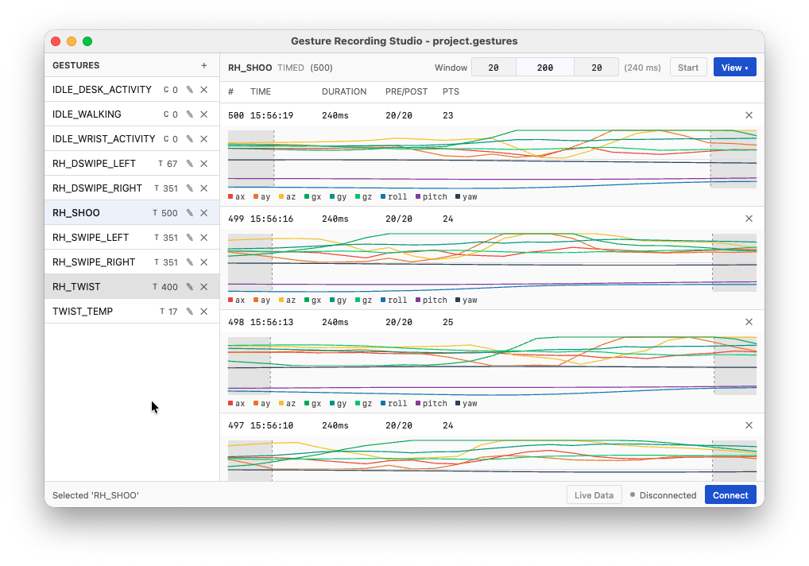
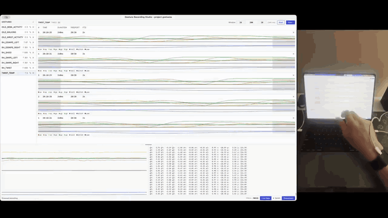

# Gesture Recording Studio

A desktop app for building IMU gesture datasets. It connects to a Symly wrist band over
Bluetooth LE, records labelled accelerometer / gyroscope / orientation streams into a
single-file project, and exports them as ML-ready CSV.



Collecting gesture data by hand is the slow part of building a wearable classifier. This
app exists to make one labelled recording cost a single keypress: pick a gesture, hit
start, and it loops — countdown, capture, save, repeat — until you stop it. Everything
lands in one `.gestures` file you can move between machines.

## Demo



Recording a timed gesture in the studio, then the trained result in use: wrist gestures
step through a field-service work order and its procedure checklist without touching the
machine. ([Full-quality video](gesture_preview.mp4))

## Features

- **Two capture modes.** Fixed-window recordings for discrete gestures, or one long
  continuous capture that you slice into training samples afterwards.
- **Hands-free interval recording.** A countdown, the capture window, and an automatic
  save, looping until you press Stop or <kbd>Space</kbd> — no clicking between reps.
- **Pre / post padding.** Each window keeps a configurable margin of data either side of
  the core gesture, so a slightly early or late movement isn't clipped.
- **Offline sampling.** Turn a continuous capture into a sample set with a sliding window
  (fixed step) or randomly placed windows.
- **Inline plots.** Every recording can be expanded into a 9-channel chart with hover
  readouts; padding regions are shaded so you can see what the model will and won't get.
- **Live monitoring.** A resizable strip with a rolling plot and a raw sample log, plus
  sample-rate and packet counters in the status bar.
- **CSV export.** Per-recording files plus a single concatenated `dataset_all.csv`.

## Requirements

| Requirement | Notes |
|---|---|
| JDK | 21 — provisioned automatically by the Gradle toolchain (Amazon Corretto) |
| Gradle | 9.1.0 via the bundled wrapper, no local install needed |
| OS | macOS, Windows, or Linux |
| Hardware | A Symly IMU band (nRF52840 firmware) and a Bluetooth LE adapter |

## Quick start

```bash
git clone https://github.com/daverlon/Gesture-Recording-Studio.git
cd Gesture-Recording-Studio

./gradlew :desktopApp:run                 # launch
./gradlew :desktopApp:hotRun --auto       # launch with hot reload
```

To build a native installer for the current platform (`.dmg`, `.msi`, or `.deb`):

```bash
./gradlew :desktopApp:packageDistributionForCurrentOS
```

On macOS the first launch asks for Bluetooth permission.

## Workflow

**1. Create a project.** `File ▸ New Project…` writes a `project.gestures` SQLite file.
There is no save step — every recording is committed as it is captured. `File ▸ Save As…`
copies the project elsewhere and reopens it.

**2. Add a gesture.** The `+` in the left panel creates one. Pick a mode at creation time,
since it is fixed afterwards:

- **Timed** (`T` badge) — repeated fixed-length windows, for discrete gestures like a swipe.
- **Continuous** (`C` badge) — one uninterrupted capture, for idle or background activity.

**3. Connect.** `Connect` in the status bar scans for bands and lists them by signal
strength.

**4. Record.** For a timed gesture, set the window as three numbers — pre, core, post
(defaults `20 / 200 / 20`, so 240 ms total) — and press Start. Each iteration counts down,
captures, pads, and saves, then starts the next one. For a continuous gesture, press
Record and it runs until you stop it.

Either mode stops on the Stop button, <kbd>Space</kbd>, or a dropped BLE connection.

**5. Sample continuous captures.** Select a capture, choose a clip length and a strategy,
and press Sample:

- **Sliding** — a window every `step` ms (default 100) across the whole capture.
- **Random** — `N` windows at random offsets (default 10), seeded from the capture id so
  the same capture always yields the same set.

**6. Export.** `File ▸ Export…` writes the CSV tree described below.

## Data model

```
Project (.gestures file)
└── Gesture                 name + mode (TIMED | CONTINUOUS)
    ├── Recording           one timed window: pre/core/post ms + samples
    ├── ContinuousCapture   one long session + samples
    └── SampleSet           clips sliced from a capture
        └── Recording       each clip, with its offset into the source capture
```

An `ImuSample` is 9 channels — `ax ay az gx gy gz roll pitch yaw` — plus the device
timestamp. A recording's `coreMs` is `durationMs - prePaddingMs - postPaddingMs`.

Storage is SQLite through SQLDelight (schema in
[`GestureDatabase.sq`](shared/src/commonMain/sqldelight/ai/symly/db/GestureDatabase.sq)).
App preferences and the last-opened project path live in Java `Preferences`, not in the
project file.

## BLE protocol

Bands are discovered by their manufacturer-data marker rather than by name: company ID
`0xFFFF` with the leading bytes `0x53 0x59` (`"SY"`). Data arrives as Nordic UART
notifications.

| Property | Value |
|---|---|
| Service | `6e400001-b5a3-f393-e0a9-e50e24dcca9e` |
| TX characteristic | `6e400003-b5a3-f393-e0a9-e50e24dcca9e` |
| Frame size | 40 bytes per sample |
| Rate | 100 Hz, batched 5 samples every 50 ms |

Each 40-byte frame is little-endian:

| Offset | Type | Field |
|---:|---|---|
| 0 | `int32` | `timestampMs` — milliseconds since device boot |
| 4 | `float32` × 3 | `gx`, `gy`, `gz` |
| 16 | `float32` × 3 | `ax`, `ay`, `az` |
| 28 | `float32` × 3 | `roll`, `pitch`, `yaw` |

Orientation is fused on the band, so the host receives Euler angles directly and never
runs a filter of its own. The angles follow the Madgwick ZYX convention.

Incoming notifications are reassembled into whole frames, and device timestamps — not
host clock time — are what define the capture window, so batching jitter cannot stretch a
recording.

## Export format

```
{export_dir}/
├── README.txt
├── dataset_all.csv
└── {Gesture}_{TIMED|CONTINUOUS}/
    ├── raw_recordings/          # timed gestures
    │   └── rec_001.csv
    ├── raw_captures/            # continuous gestures
    │   └── cap_001.csv
    └── sample_sets/
        └── sliding_001/
            ├── info.txt         # strategy, clip length, step or count
            └── sample_001.csv
```

Every CSV carries commented metadata above the header:

```csv
# Gesture: RH_SWIPE_LEFT, Mode: TIMED, Duration: 240ms, PrePadding: 20ms, PostPadding: 20ms
# Recorded: 2026-08-11T07:56:19.412Z, Samples: 24
timestamp_ms,ax,ay,az,gx,gy,gz,roll,pitch,yaw
0,...
10,...
```

`dataset_all.csv` concatenates everything with two extra leading columns:

```csv
gesture,sample_id,timestamp_ms,ax,ay,az,gx,gy,gz,roll,pitch,yaw
```

Note that exported `timestamp_ms` is regenerated as `index × 10` at 100 Hz rather than
copied from the device clock, so rows are evenly spaced.

## Settings

`File ▸ Settings…`

| Setting | Default | Notes |
|---|---|---|
| Auto-open last project | off | Reopens the previous `.gestures` file on launch |
| Countdown seconds | 3 | 1–10, applies before every timed capture |
| Countdown beeps | off | Audio cue each second. Best left off on macOS, where audio can disturb a Bluetooth connection |

## Project layout

```
desktopApp/          JVM entry point, windows, menus, file dialogs, CSV export
  main.kt            application shell, project + export handling
  SettingsWindow.kt
shared/
  commonMain/        UI and logic shared across targets
    App.kt           main composable: panels, recording session, plots
    ble/             device scan, connect, frame parsing
    db/              SQLDelight access
    sqldelight/      database schema
  jvmMain/           JVM implementations: SQLite driver, beep, byte parsing
```

The module split is Kotlin Multiplatform, but only the JVM desktop target is implemented
today; the `shared` module is arranged so mobile targets could be added without moving
logic.

## Tech stack

Compose Multiplatform 1.11.1 · Kotlin 2.4.0 · Material 3 · SQLDelight 2.0.2 ·
[Kable](https://github.com/JuulLabs/kable) 0.42.0 for BLE · kotlinx coroutines, datetime,
and serialization.

## Limitations

- A physical band is required — there is no synthetic or replay data source.
- Import is not implemented; export is one-way.
- Device timestamps drive the capture window but are not persisted, so they are not
  recoverable after reopening a project.
- Sample sets are always sliced with zero padding, regardless of the timed-mode padding
  defaults.
- A gesture's mode cannot be changed after it is created.
